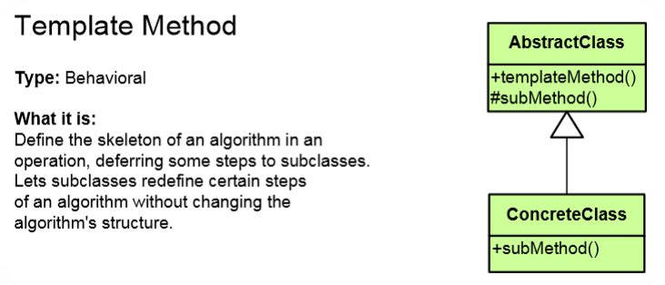

# Тemplate Method
### Behavioral Design Pattern

## Описание
Дафинира основата на алгоритъм в метод, оставяйки някаква имплементация на неговите подкласове.

Използва се когато даден алгоритъм изпълнява дадена задача в определена последователност, но част от стъпките могат да се изпълняват по различен начин в зависимост от имплементацията. Това може да бъде постигнато с наследяване, вместо с имплементирането на Strategy Pattern.

При ползването на Тemplate Method имаме определен скелет на един алгоритъм при дадена операция, отстъпвайки някои стъпки за имплементиране от подкласове. Те от своя страна предефинират някои стъпки, но без да се променя цялостната структурата на алгоритъма.

## Implemntation

###### public abstract class Salad - това е темплейния клас който задава базовия алгоритъм за правене на салата. 
Абстрактните методи ще бъдат имплементирани в зависимост от конкретните изисквания на наследниците. 
~~~c#

    public abstract class Salad
    {

        public void PrepareRecipe(List<IIngredient> ingredients)
        {
            CutIngredients(ingredients); 
            AddSpices();
        }

        public abstract void CutIngredients(List<IIngredient> ingredients);
        public abstract void AddSpices();
    }
~~~

~~~c#
    public class ShopskaSalad : Salad
    {
        public override void CutIngredients(List<IIngredient> ingredients)
        {
            foreach(var ingredient in ingredients)
            {
                Console.WriteLine("{0} is cut in cubes", ingredient.GetType().Name);
            }
        }

        public override void AddSpices()
        {
            Console.WriteLine("Added salt, vinegret and olive oil");
        }
    }
~~~

~~~c#
    public class SelskaSalad : Salad
    {
        public override void CutIngredients(List<IIngredient> ingredients)
        {
            foreach(var ingredient in ingredients) 
            {
                Console.WriteLine("{0} is cut in slices", ingredient.GetType().Name);            
            }
        }
        public override void AddSpices()
        {
            Console.WriteLine("Added salt and olive oil");
        }
    }
~~~
###### Пълният код - в демото. 