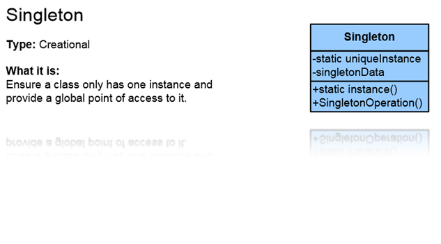
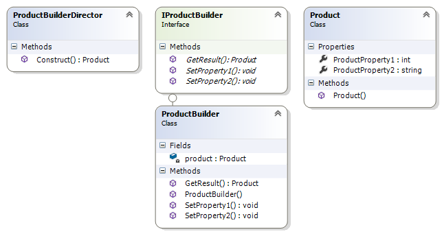

##Singleton Pattern##

Singleton Pattern е object **creational** шаблон, защото има отношение към създаването на обекти. По-специално, той цели да ограничи създаването на повече от един обект от конкретен клас. Singleton Pattern е **object** шаблон, защото е ангажиран с връзките между обектите (т.е. уникалната инстанция към обект, която даден клас държи и достъпа на други обекти до него).
Това е Design Pattern, който нарушава някой от ООП принципи (и SOLID _single responsibility_). Затова този патърн носи със себе си 'тежести', проблеми за отстраняване.

**Необходимостта** от прилагане на Singleton Pattern възниква при моделиране на обекти, които имат само една инстанция в реалния свят. Така например, в клас *Computer* може да има само едно устройство за възпроизвоеждане на звук. В случай, че се допусне създаването на няколко такива устройства и едновременното извеждане на различен звук, крайният резултат ще се различава от очаквания.

**Целите**, които се преследват при прилагането на Singleton Pattern са две:

+ подсигуряване създаването на само една инстанция на даден клас;
+ осигуряване на достъп до тази инстанция.
 
Singleton Pattern е **приложим** при наличие на конкурентни заявки за достъп до (общи) ресурси, което води до необходимост от централизирано осигуряване на достъпа до тях.

В софтуерния дизайн, **употребата** на Singleton Pattern се е наложила в следните случаи:

+  при дизайн на *Logger* класове;
+  при дизайн на *Configuration* класове;
+  при достъп до споделени ресурси (напр. сериен порт);
+  в комбинация с Abstract Factory или Factory Method шаблоните, при тяхното използване в многонишкова среда.

Singleton Pattern се **имплементира** чрез *static поле* в Singleton класа,  *private конструктор* и *static public метод*, който връща референция към static полето.

	using System.Runtime.CompilerServices;

    internal class Singleton
    {
        private static Singleton instance;

        private int exampleField;

        private Singleton()
        {
        }

        [MethodImpl(MethodImplOptions.Synchronized)]
        public static Singleton GetInstance()
        {
            if (instance == null)
            {
                return new Singleton();
            }
            else
            {
                return instance;
            }
        }

        public void ExampleMethod()
        {
        }
    }

При имплементацията на Singleton Pattern **участват** Singleton класа и клиента.

+ *Singleton класа* дефинира метод, който дава възможност за достъп до неговата уникална инстанция. Инстанцирането се реализира като static метод, която отговаря за създаването на единствена инстанция на класа.
+ *Клиентът* получава достъп до Singleton класа, единствено чрез неговия static метод.

**Следствията** от използването на Singleton Pattern са:

+ осигуряване на контролиран достъп на клиентите до единствената инстанция на Singleton класа;
+ разширяване функционалността в сравнение с глобалните променливи;
+ възможност за наследяване и разширяване функционалността на Singleton класа;
+ гъвкавост в сравнение с операциите върху класове;

Структура:

## Factory Method Pattern##

Factory Method шаблона дефинира абстрактен клас за съдаване на обекти от друг клас, но избора на конкретен тип на обекта, който трябва да бъде създаден се прави от други класове по време на изпълнение на приложението.

Factory Method шаблона отговаря на **необходимостта** от интерфейс за създаване на различни обекти, като конкретния тип на инстанцирания обект се избира в зависимост от заявката на друг клас. Новосъздадените обекти се реферират чрез общ интерфейс.

Factory Method шаблона е **приложим** в случаите, в които класа, създаващ обекти, не може да предположи, какъв клас обект се очаква да бъде създаден. Единствено класа, който прави заявка за създаване на обект може да укаже неговия тип.

Factory Method шаблона намира широка **употреба** в ООП дизайна. Някои от най-честите приложения са:

+ toolkit, utility класове и framework-и;
+ MacApp, ET++, Unidraw. Smalltalk, Orbix ORB.

Factory Method шаблона се **имплементира** по два основни начина - чрез дефиниране на абстрактен Creator клас, който не съдържа имплементаниця на самия factory метод или чрез дефиниране на конкретен клас, който имплементира самия метод.

	public interface IProduct
	{
	    public void DoSomething();
	}

	public class ConcreteProduct1 : IProduct
	{
	    public void DoSomething()
	    {
	        // doing something in ConcreteProduct1 way;
	    }
	}

	public class ConcreteProduct2 : IProduct
	{
	    public void DoSomething()
	    {
	        // doing something in ConcreteProduct2 way;
	    }
	}

	public enum ProductType
	{
	    ProductType1,
	    ProductType2
	}

	public class Factory
	{
	    public IProduct CreateProduct(ProductType type)
	    {
	        IProduct product = null;
	        switch (type)
	        {
	            case ProductType.ProductType1:
	                product = new ConcreteProduct1();
	                break;
	            case ProductType.ProductType2:
	                product = new ConcreteProduct2();
	                break;
	            default:
	                break;
	        }

	        return product;
	    }
	}

При имплементацията на Factory Method шаблона **участват**:

+ *Product интерфейса* - дефинира интерфейс за обектите, които се създават от Factory метода;
+ *ConcreteProduct* - имплементира Product интерфейса;
+ *Factory* - декларира самия метод, който създава обекти;
+ *ConcreteFactory* (когато Factory класа е абстрактен; липсва в примера) - надгражда Factory класа с цел създаване на конкретен Product.

В **следствие** използването на Factory Method шаблона, отпада необходимостта от свързване на приложението с конкретни класове. Кодът използва единствено Product интерфейса, което прави възможна работата му с много различни ConcreteProduct класове.

**Структура**

##Builder Pattern##

Този шаблон позволява на Client обект да конструира комплексен обект, като задава само неговите тип и съдържание, без да е необходимо да познава детайлите по създаването му (съставни обекти, поредност на създаване, инициализация и др.). 

**Необходимостта** от прилагане на Builder шаблона е продиктувана от моделирането на комплексни обекти, съставени от други обекти, чието създаване предполага следването на специфична процедура.

**Целта** на Builder шаблона е да бъде дефиниран клас за създаване на обекти, но решението за това, обект от какъв клас да бъде създаден, да остане под контрола на използващите го класове.
Създаващият клас реферира създадения обект чрез общ интерфейс.

Builder шаблонът е **приложим** в случаите, в които:

+ алгоритъмът за създаване на комплексни обекти е независим от от логиката, отговаряща за самото конструиране;
+ процесът на конструиране трябва да позволява създаване на различни "версии" от обекта (чрез използване на различни съставни обекти или при различна поредност на създаване, инициализация и др.).

Builder шаблонът се **имплементира** чрез Builder клас, който дефинира абстрактен интерфейс за създаване на отделните части на Product обекта и Director клас, който създава Product обекта, използвайки Builder класа.

	public class Product
    {
        public Product()
        {
        }

        public int ProductProperty1 { get; set; }

        public string ProductProperty2 { get; set; }
    }

	public interface IProductBuilder
    {
        void SetProperty1(int value);

        void SetProperty2(string value);

        Product GetResult();
    }

	public class ProductBuilder : IProductBuilder
    {
        private Product product;

        public ProductBuilder()
        {
            this.product = new Product();
        }

        public void SetProperty1(int value)
        {
            this.product.ProductProperty1 = value;
        }

        public void SetProperty2(string value)
        {
            this.product.ProductProperty2 = value;
        }

        public Product GetResult()
        {
            return this.product;
        }
    }

	public class ProductBuilderDirector
    {
        public Product Construct()
        {
            ProductBuilder builder = new ProductBuilder();

            builder.SetProperty1(4);
            builder.SetProperty2("Some property vale");

            return builder.GetResult();
        }
    }

При имплементацията на Builder шаблонът **участват**:

+ *Builder* класът, който дефинира абстрактен интерфейс за създаване на частите на Product обекта;
+ *ConcreteBuilder* класът, който "сглобява" частите на обекта, използвайки дефинирания от Builder-а интерфейс; той следи за конкретната "версия" на обекта, който създава;
+ *Director* класът, който създава комплексния обект, използвайки дефинирания от Builder-а интерфейс;
+ *Product* класът на обектите, които се създават;

В следствие използването на Builder шаблона, се постига:

+ възможност за лесна промяна на вътрешното представяне на Product класа чрез създаване на нов ConcreteBuilder клас;
+ отделяне на алгоритъма за конструиране и този на представяне на Product класа;
+ осигуряване на по-рецизен контрол върху процеса на конструиране на обекти.

**Структура**

## Object Pool

* **Мотивация:**
	- Създава се обекта в момента, когато бъде нужен. Използва се и след това се приготвя в началното си състояние

* **Цел:**
	- Да се избегне новото създаване на 'скъпо струващи' обекти
	- задържа се подготвени за ново използване, докато не са нужни

* **Приложение:**
	- Connection Pool в *ADO.NET* създава се конекция, използва се, след което бива изтривана
	- Unity за създаването на средата, повтарящите се картинки, в игрите (да не се създават отново)
	- Склад с екипировка за определена фирма

* **Известни употреби:**
	- Connection Pool
	- връзките в базата данни
	
* **Имплементация** (реално изпълнение)
	~~~c#
	namespace ObjectPool
	{
	    using System;
	    using System.Collections.Generic;

	    /// 

	    /// The Pool class is the most important class in the object pool design pattern. It controls access to the
	    /// pooled objects, maintaining a list of available objects and a collection of objects that have already been
	    /// requested from the pool and are still in use. The pool also ensures that objects that have been released
	    /// are returned to a suitable state, ready for the next time they are requested.
	    /// 

	    /// <typeparam name="T">The pool objects type.</typeparam>
	    public class Warehouse<T> where T : IDisposable, new()
	    {
	        private readonly List<T> availableEquipment = new List<T>();
	        private readonly List<T> usedEquipment = new List<T>();

	        // We can define the size of the pool in constructor
	        public Warehouse()
	        {
	        }

	        public T GetEquipment()
	        {
	            lock (this.availableEquipment)
	            {
	                if (this.availableEquipment.Count != 0)
	                {
	                    var equipment = this.availableEquipment[0];
	                    this.usedEquipment.Add(equipment);
	                    this.availableEquipment.RemoveAt(0);
	                    return equipment;
	                }
	                else
	                {
	                    var equipment = new T();
	                    this.usedEquipment.Add(equipment);
	                    return equipment;
	                }
	            }
	        }

	        public void ReleaseEquipment(T equipment)
	        {
	            equipment.Dispose();

	            lock (this.availableEquipment)
	            {
	                this.availableEquipment.Add(equipment);
	                this.usedEquipment.Remove(equipment);
	            }
	        }
	    }
	}
	~~~

* **Участници**
	- Reusable - инстанция, която си комуникира с останалите за определен период от време
	- Client - инстанция на класа, която в използва Reusable обект
	- ReusablePool - инстанция, която управлява Reusable обектите използвани от Client'а

* **Последствия**
	- усложняване на кода, но за сметка на това многократно се подобрява производителността (performance)

* **Структура**
	

