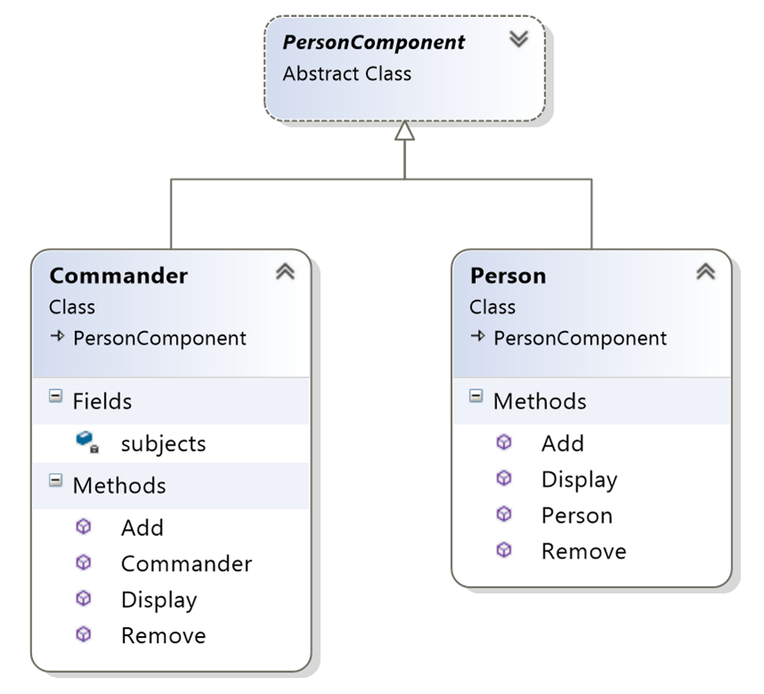

## Structural Design Patterns

### **Composite** ###

##### Мотивация
Composite design pattern се използва когато се създават йерархични модели на обекта. Той дефинира начина по който се прави дизайна на рекурсивната дървовидната стуктура от обекти, където индивидуалните обекти и групи могат да се достъпват.

##### Цел

Целта на този дизайн е да композира обектите в дървовидна структура която да представи част или цялата йерархия.

 
##### Приложение

Позволява на клиента да третира индивидуалните обекти и компоненти по един с същи начин.

##### Употреба
Windows.Forms.Control

System.Web.UI.Control

System.Xml.XmlNode


##### Имплементация

```c#    

    public abstract class Component
    {
        protected readonly string name;

        protected Component(string name)
        {
            this.name = name;
        }

        public abstract void Operation();
        public abstract void Display(int depth);
    }


    public class Composite : Component
    {
        private readonly List<Component> children;

        public Composite(string name)
            : base(name)
        {
            this.children = new List<Component>();
        }

        public void AddChild(Component component)
        {
            this.children.Add(component);
        }

        public void RemoveChild(Component component)
        {
            this.children.Remove(component);
        }

        public override void Operation()
        {
            string msg = string.Format("Composite with {0}", this.children.Count);
            Console.WriteLine(msg);
        }

        public override void Display(int depth)
        {
            Console.WriteLine(new String('-', depth) + name);
            foreach (var component in children)
            {
                component.Display(depth + 2);
            }
        }
    }


    public class Leaf:Component
    {
        public Leaf(string name)
            : base(name)
        {
        }
        
        public override void Operation()
        {
            Console.WriteLine("Leaf.");
        }

        public override void Display(int depth)
        {
            Console.WriteLine(new String('-', depth) + name);
        }
    }


    public class Program
    {
        public static void Main()
        {
            var root = new Composite("root");
            root.AddChild(new Leaf("Leaf 1"));
            root.AddChild(new Leaf("Leaf 2"));

            var comp = new Composite("Composite C");
            comp.AddChild(new Leaf("Leaf C.1"));
            comp.AddChild(new Leaf("Leaf C.2"));

            root.AddChild(comp);
            root.AddChild(new Leaf("Leaf 3"));

            var leaf = new Leaf("Leaf 4");
            root.AddChild(leaf);
            root.RemoveChild(leaf);

            root.Display(1);
        }
    }

```
##### Участници
Component

Composite

Leaf

##### Структура


