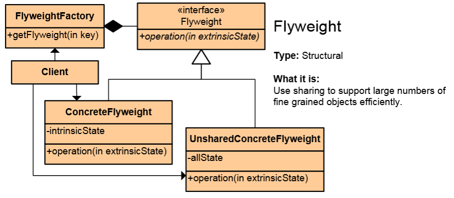

# Flyweight

## Мотивация

 * Използва се за споделяне на големи и трудни за създаване отнемащи памет обекти, и когато паметта може да бъде споделена между няколко обекта.
 

## Цел

 * Минимализиране на създадените класове и вдигане на абстракцията.

## Приложение

 * Правим един единствен обект и разликите в неговото използване са, че подаваме като параметар на методите му разликите в идползването на различните обекти.
	Общата памет на обектите влиза като полета във Flyweight, а различните типове данни се подават като параметри.
 
* Паметта се разделя на два типа:
	- памет, която може да бъде споделена
	- памет, която не може да бъде споделена,подава се като параметър.
 
## Имплментация 

```c#
using System;
using System.Collections;

namespace Flyweight.Structural
{
  class MainApp
  {
    static void Main()
    {
      // Arbitrary extrinsic state
      int extrinsicstate = 22;

      FlyweightFactory factory = new FlyweightFactory();

      // Work with different flyweight instances
      Flyweight fx = factory.GetFlyweight("X");
      fx.Operation(--extrinsicstate);

      Flyweight fy = factory.GetFlyweight("Y");
      fy.Operation(--extrinsicstate);

      Flyweight fz = factory.GetFlyweight("Z");
      fz.Operation(--extrinsicstate);

      UnsharedConcreteFlyweight fu = new
        UnsharedConcreteFlyweight();

      fu.Operation(--extrinsicstate);

      // Wait for user
      Console.ReadKey();
    }
  }

  /// <summary>
  /// The 'FlyweightFactory' class
  /// </summary>
  class FlyweightFactory
  {
    private Hashtable flyweights = new Hashtable();

    // Constructor
    public FlyweightFactory()
    {
      flyweights.Add("X", new ConcreteFlyweight());
      flyweights.Add("Y", new ConcreteFlyweight());
      flyweights.Add("Z", new ConcreteFlyweight());
    }

    public Flyweight GetFlyweight(string key)
    {
      return ((Flyweight)flyweights[key]);
    }
  }

  /// <summary>
  /// The 'Flyweight' abstract class
  /// </summary>
  abstract class Flyweight
  {
    public abstract void Operation(int extrinsicstate);
  }

  /// <summary>
  /// The 'ConcreteFlyweight' class
  /// </summary>
  class ConcreteFlyweight : Flyweight
  {
    public override void Operation(int extrinsicstate)
    {
      Console.WriteLine("ConcreteFlyweight: " + extrinsicstate);
    }
  }

  /// <summary>
  /// The 'UnsharedConcreteFlyweight' class
  /// </summary>
  class UnsharedConcreteFlyweight : Flyweight
  {
    public override void Operation(int extrinsicstate)
    {
      Console.WriteLine("UnsharedConcreteFlyweight: " +
        extrinsicstate);
    }
  }
}
 
  ```

## UML  диаграма

